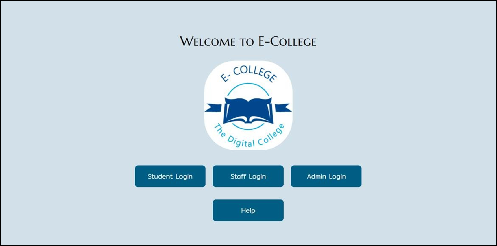
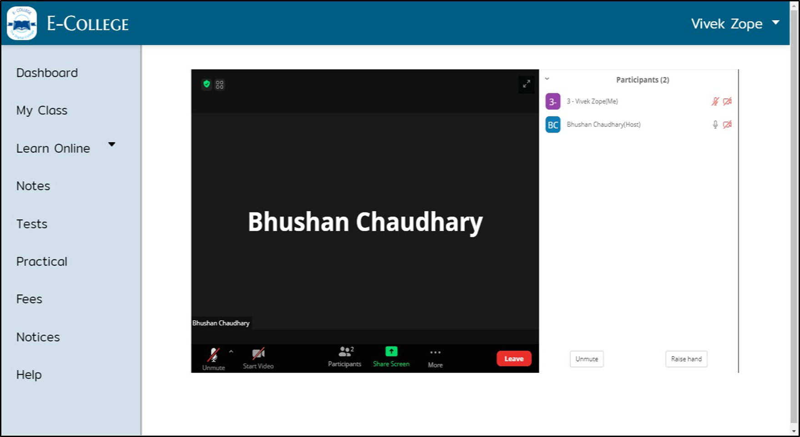
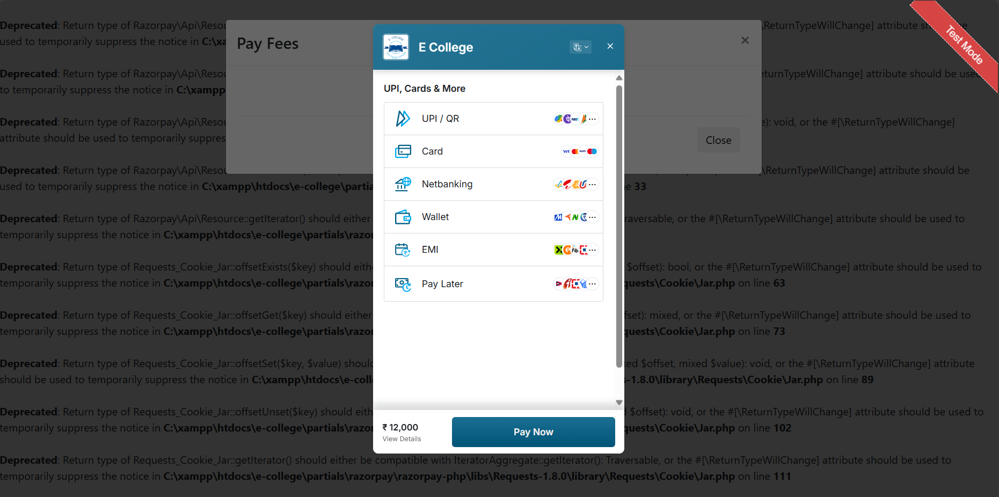
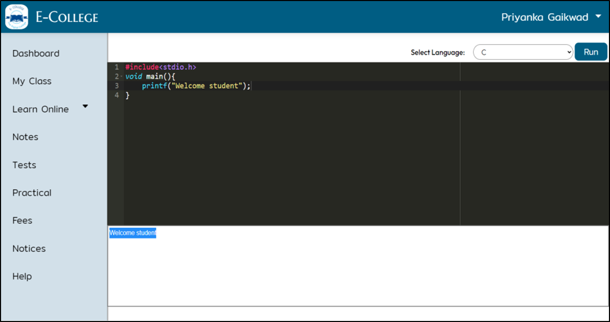
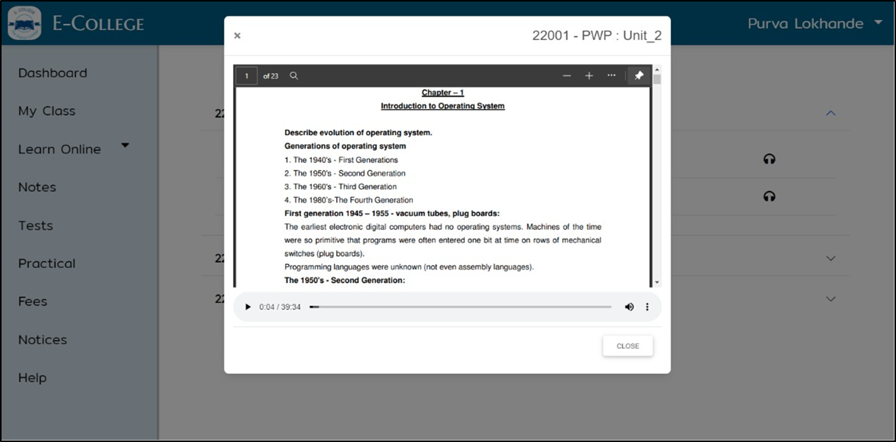
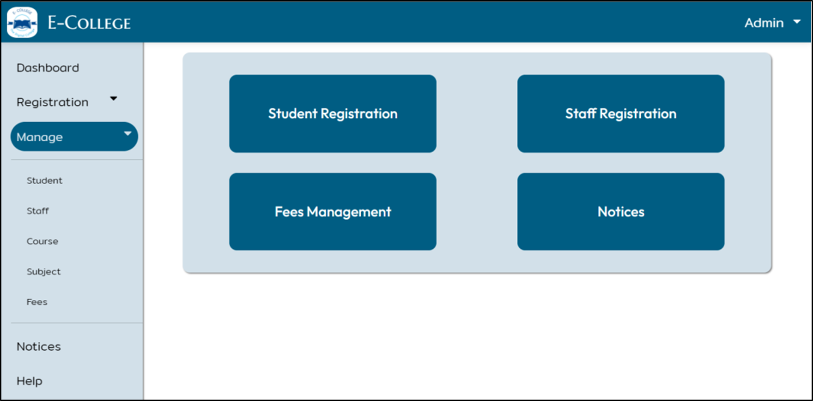
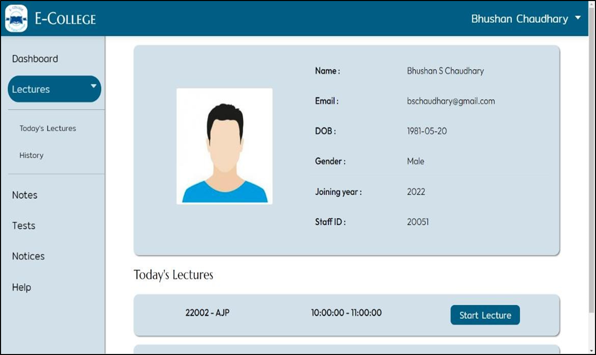
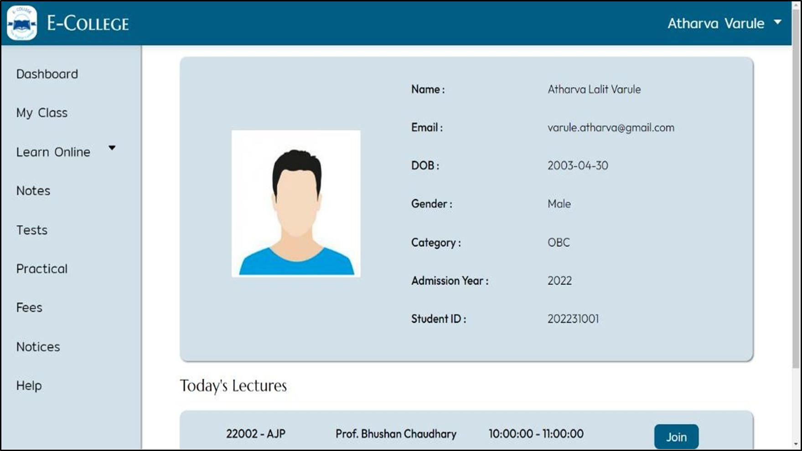

# 🎓 E-College: A Comprehensive Online Learning Platform
## 📚 Introduction
E-College is a web-based platform designed to streamline educational processes, offering a comprehensive solution for students, faculty, and administrators. It aims to replicate the traditional college experience online, providing features for online lectures, assignments, assessments, fee management, and more.

## 🌟 Features
- 🎥 **Online Lectures**: Seamless integration with Zoom for interactive live classes.
- 📄 **Notes & Audio-Notes:** Faculty can upload notes, and the system generates audio versions for accessibility.
- 💻 **Online Compiler**: Integrated code editor and compiler for computer science students.
- 💳 **Fees Management**: Secure online fee payments through Razorpay integration.
- 📧 **Mail Sending**: Automated email notifications and updates using PHPMailer for seamless communication.
- 📝 **Online Tests**: MCQ-based assessments with time limits and automated grading.
- 📢 **E-Noticeboard**: Digital platform for announcements and notifications.
- 🆘 **Help Section**: Video tutorials and support resources for users.

## 📸 Screenshots

For any issues, please contact me at [athrvarule@gmail.com](mailto:athrvarule@gmail.com). 📧

Feel free to contribute to the project by submitting issues or pull requests. Happy coding! 🎉